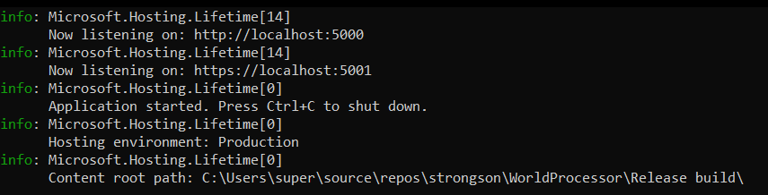

# 🏭 World Processor
Web Api service that provides functionality to generate and iterate world.

## API

World Processor has 2 endpoints:

### Generate World

`POST https://localhost:5001/WorldProcessing/Generate`

Request body:

```typescript
{
	"seed": => Number,
	"dimensions" => Array<number>?
	"worldConfig": WorldConfig
}
```

### Iterate World

`POST https://localohost:5001/WorldProcessing/Iterate`

Request body:

```typescript
{
	"world": => World,
	"worldConfig": => WorldConfig
}
```


##  Latest applicaiton build
It's located [here](../blob/master/WorldProcessor/build).

To use it, just run `WorldProcessor.WebApi.exe` executable file and find application address and port in console.

*Note: by default, application listens 2 ports: 5000 for http and 5001 for https*



## Development
For development install .NET SDK - https://dotnet.microsoft.com/en-us/download.
Use IDE that support development on .NET like [Visual Studio](https://visualstudio.microsoft.com/) or [Intellij Rider](https://www.jetbrains.com/rider/).

### Swagger
To use Swagger functionality, get on `http://localohost:5000/Swagger` or `https://localohost:5001/Swagger`.
Swagger is enabled only in **Debug** configuration.
