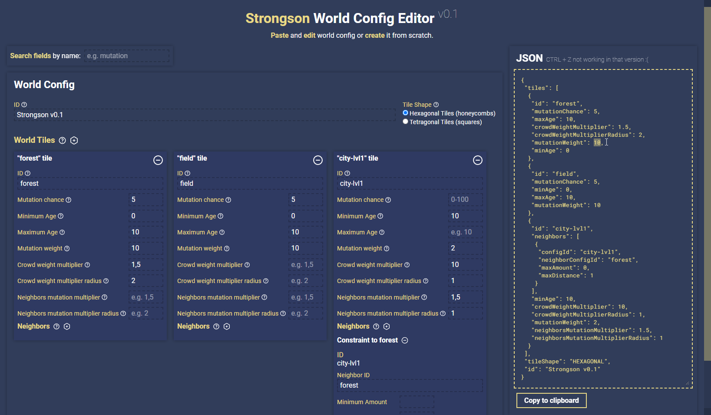

# 🧱 Strongson Config Editor

Utility to configure worlds (represented as JSON files) for Strongson via UI.



## Address
Latest stable version is available at: https://strongson-config-editor.surge.sh

<details> 
  <summary>Test config to play around:</summary>

```JSON
{
 "tiles": [
  {
   "id": "forest",
   "mutationChance": 5,
   "maxAge": 10,
   "crowdWeightMultiplier": 1.5,
   "crowdWeightMultiplierRadius": 2,
   "mutationWeight": 10,
   "minAge": 0
  },
  {
   "id": "field",
   "mutationChance": 5,
   "minAge": 0,
   "maxAge": 10,
   "mutationWeight": 10
  },
  {
   "id": "city-lvl1",
   "neighbors": [
    {
     "configId": "city-lvl1",
     "neighborConfigId": "forest",
     "maxAmount": 0,
     "maxDistance": 1
    }
   ],
   "minAge": 10,
   "crowdWeightMultiplier": 10,
   "crowdWeightMultiplierRadius": 1,
   "mutationWeight": 2,
   "neighborsMutationMultiplier": 1.5,
   "neighborsMutationMultiplierRadius": 1
  }
 ],
 "tileShape": "HEXAGONAL",
 "id": "Strongson v0.1"
}
```

</details>


## Features
* 2 way-data-binding: changes in input fields are instantly reflected on JSON and vice-versa.
* Search by config fields; saves some time scrolling.

## Development
To start dev server, run `npm run start` in Config Editor root directory:
```
cd config-editor
npm run start
```

To build production build, run `npm run build` in Config Editor root directory:
```
cd config-editor
npm run build
```

## Technologies used

* [TypeScript](https://www.typescriptlang.org/) - programming language;
* [React](https://reactjs.org/) - library to build UIs;
* [Sass](https://sass-lang.com/) - CSS processor;
