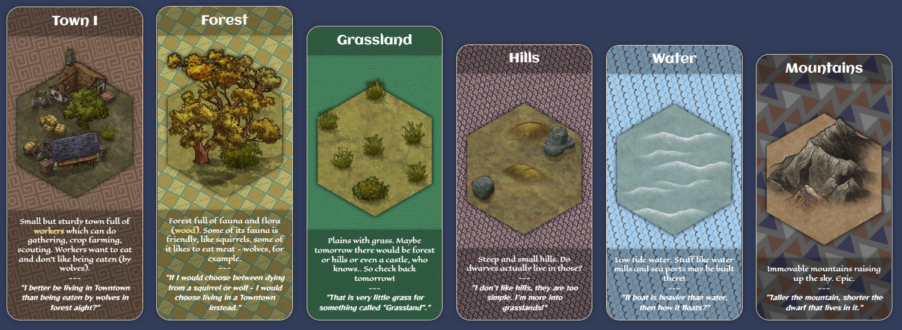
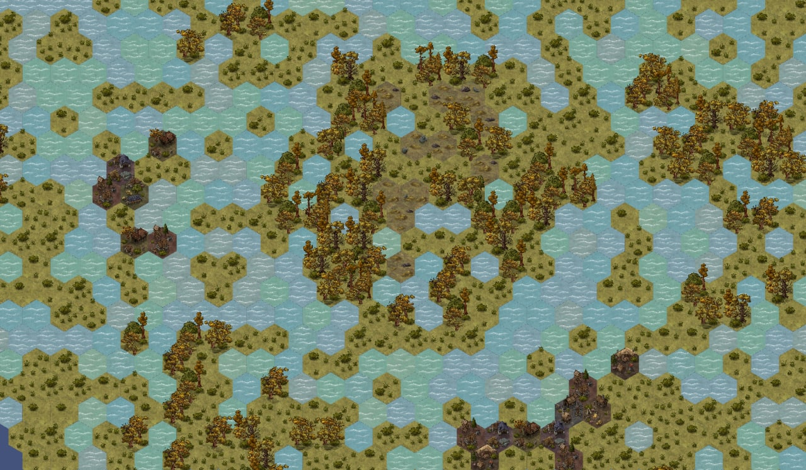

# 🦜 Strongson Frontend

## Draft
Game implementation is in progress and no game prototype created yet.

## Prototypes

### Tiles preview
Tiles and their info represented as "cards":

### World preview
Actual world generated by World Generator based on actual world config (copy lost):

## Technologies

* [TypeScript](https://www.typescriptlang.org/) - programming language
* [React](https://reactjs.org/) - library to build UIs
* [React Redux](https://react-redux.js.org/) - application state management library for ReactJS apps
* [React Router](https://reactrouter.com/) - browser router library for ReactJS apps
* [Sass](https://sass-lang.com/) - CSS processor
* [Three.js](https://threejs.org/) - "graphics engine in browser" library
* [react-three-fiber](https://github.com/pmndrs/react-three-fiber) - ReactJS [reconciler](https://reactjs.org/docs/reconciliation.html) for ThreeJS
* [@react-three/drei](https://github.com/pmndrs/drei) - ThreeJS helpers for react-three-fiber

### Client-Server Communication
* [Socket.IO](https://socket.io/)

### Project Assembly
* [webpack](https://webpack.js.org/)
* [Babel](https://babeljs.io/)
