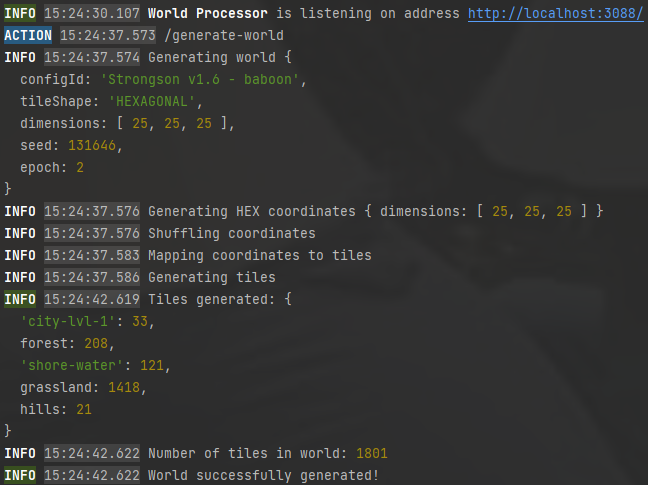
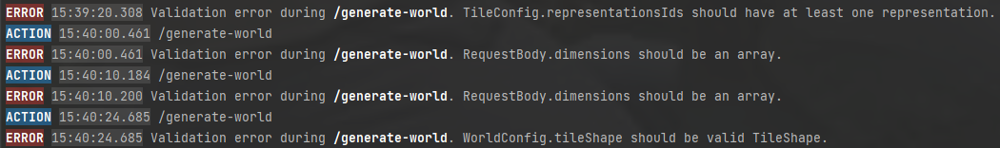

# 🏭 World Processor

NodeJS implementation of stateless HTTP API service for generating and iterating worlds.



## Draft implementation

Implementation is aimed at proving theory-crafting and thus not optimized for best performance.
But high performance is still an aim for that service, yet not very prioritized aim.

World iterations not implemented in the latest version.

## Features
Features of whole "NodeJS World Processor" module:

* World generation;
* Code is well documented, thus greatly helping with understanding how world generation works;
* Validation messages in console & request response if something is wrong with WorldConfig:


## API
World Processor is an HTTP API web service, meaning it communicates via HTTP requests.

You can make HTTP requests via [JS](https://developer.mozilla.org/en-US/docs/Web/API/Fetch_API). Or via API platforms
to skip hassle of setting up headers, escaping characters and formatting.

In `~/world-processor/misc/` [directory](https://github.com/Max-Dov/strongson/blob/main/world-processor/misc/Strongson%20World%20Processor%20(NodeJS)%20API.postman_collection.json)
you can find [Postman](https://www.postman.com) collection for World Processor.

### Generate world
World generation endpoint has the following signature:
```
POST http://localhost:3088/generate-world
```

Request body:

```typescript
// TypeScript
interface GenerateWorldBody {
    epoch: World['epoch'];
    seed: World['seed'];
    dimensions: World['dimensions'];
    worldConfig: WorldConfig;
}
```
Note: try keeping dimensions around `10` number for best performance (<1 sec to generate world). As example, dimensions like `[25, 25, 25]` would make request to hang for 5 seconds.

<details> 
  <summary>Example of request body to play with:</summary>

```JSON
{
  "dimensions": [
    10,
    10,
    10
  ],
  "epoch": 2,
  "seed": 131646,
  "worldConfig":
  {
    "tileShape": "HEXAGONAL",
    "id": "Strongson v1.6 - baboon",
    "tiles": [
      {
        "id": "grassland",
        "representationsIds": [
          "0",
          "1",
          "2",
          "3",
          "4",
          "5"
        ],
        "mutationChance": 1,
        "mutationWeight": 1
      },
      {
        "id": "hills",
        "neighbors": [
          {
            "configId": "hills",
            "neighborConfigId": "city-lvl-1",
            "maxAmount": 0,
            "maxDistance": 10
          },
          {
            "configId": "hills",
            "neighborConfigId": "hills",
            "maxAmount": 10,
            "maxDistance": 20
          }
        ],
        "representationsIds": [
          "0",
          "1",
          "2",
          "3",
          "4",
          "5"
        ],
        "mutationChance": 1,
        "mutationWeight": 2,
        "crowdWeightMultiplier": 3,
        "crowdWeightMultiplierRadius": 3,
        "minAge": 5
      },
      {
        "id": "forest",
        "neighbors": [
          {
            "configId": "forest",
            "neighborConfigId": "city-lvl-1",
            "maxAmount": 0,
            "maxDistance": 5
          },
          {
            "configId": "forest",
            "neighborConfigId": "forest",
            "maxAmount": 40,
            "maxDistance": 15
          }
        ],
        "representationsIds": [
          "0",
          "1",
          "2",
          "3",
          "4",
          "5"
        ],
        "mutationChance": 1,
        "mutationWeight": 2,
        "crowdWeightMultiplier": 3,
        "crowdWeightMultiplierRadius": 3,
        "minAge": 5
      },
      {
        "id": "city-lvl-1",
        "neighbors": [
          {
            "configId": "city-lvl-1",
            "neighborConfigId": "city-lvl-1",
            "maxAmount": 15,
            "maxDistance": 30
          },
          {
            "configId": "city-lvl-1",
            "neighborConfigId": "mountain",
            "maxDistance": 3,
            "maxAmount": 0
          },
          {
            "configId": "city-lvl-1",
            "neighborConfigId": "hills",
            "maxAmount": 0,
            "maxDistance": 5
          },
          {
            "configId": "city-lvl-1",
            "neighborConfigId": "forest",
            "maxAmount": 0,
            "maxDistance": 5
          }
        ],
        "representationsIds": [
          "0",
          "1",
          "2",
          "3",
          "4",
          "5",
          "6",
          "7"
        ],
        "mutationChance": 1,
        "mutationWeight": 5,
        "crowdWeightMultiplier": 3,
        "crowdWeightMultiplierRadius": 1,
        "neighborsMutationMultiplier": 2,
        "neighborsMutationMultiplierRadius": 1,
        "maxAge": 8
      },
      {
        "id": "shore-water",
        "neighbors": [
          {
            "configId": "shore-water",
            "neighborConfigId": "mountains",
            "maxAmount": 0,
            "maxDistance": 3
          },
          {
            "configId": "shore-water",
            "maxAmount": 30,
            "maxDistance": 20,
            "neighborConfigId": "shore-water"
          }
        ],
        "mutationChance": 1,
        "minAge": 10,
        "mutationWeight": 2,
        "neighborsMutationMultiplier": 5,
        "neighborsMutationMultiplierRadius": 1,
        "representationsIds": [
          "0",
          "1",
          "2",
          "3",
          "4",
          "5"
        ],
        "crowdWeightMultiplier": 3,
        "crowdWeightMultiplierRadius": 3
      },
      {
        "id": "mountains",
        "neighbors": [
          {
            "configId": "mountains",
            "neighborConfigId": "hills",
            "minAmount": 3,
            "maxDistance": 1
          }
        ],
        "mutationChance": 1,
        "minAge": 20,
        "mutationWeight": 30,
        "neighborsMutationMultiplier": 3,
        "neighborsMutationMultiplierRadius": 2,
        "representationsIds": [
          "0",
          "1",
          "2",
          "3",
          "4",
          "5"
        ]
      }
    ]
  }
}
```

</details>

Returned response is `World` model; refer to [world contracts](https://github.com/Max-Dov/strongson/blob/main/notes/contracts.md#world-contracts) for more info.

## Development
To start World Processor locally, install dependencies via `npm i` and run `npm run restart-world-processor` in World Processor root directory:
```
cd world-processor
npm i
npm run restart-world-processor
```
In console, you should see following line:
```
INFO 16:25:13.735 World Processor is listening on address http://localhost:3088/
```
Indicating that World Processor is up and running.

### Port re-assign

To change port on which World Processor runs, head to `~/world-processor/config/.env` file 
to update variable `PORT` to desired port number.
[Link to GitHub file just in case](https://github.com/Max-Dov/strongson/blob/main/world-processor/config/.env).

## Tech Stack

* [Node.js](https://nodejs.org/en/) - JS runtime platform;
* [TypeScript](https://www.typescriptlang.org/) - programming language;
* [Express](https://expressjs.com) - web framework, in project used for setting up endpoints.

### Project Assembly
* [webpack](https://webpack.js.org/)
* [Babel](https://babeljs.io/)